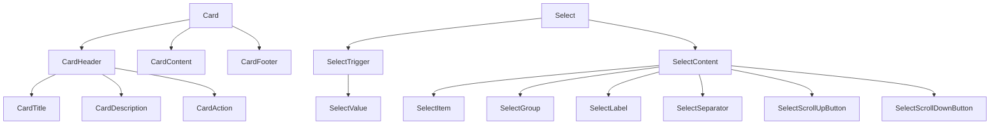

# System Patterns

## System Architecture

GebKit follows a component-based architecture with clear separation between:
1. **Core Component Logic**: The functional behavior of components
2. **Styling**: Visual presentation through Tailwind and custom utilities
3. **Demo Application**: Website showcasing component usage

The architecture is organized as follows:
- `app/components/flat/`: Contains all flat design components
- `app/components/neumorphic/`: Contains all neumorphic design components
- `app/routes/flat+/`: Demo routes for flat components
- `app/routes/neumorphic+/`: Demo routes for neumorphic components
- `app/utils/`: Shared utilities for components

## Key Technical Decisions

1. **Radix UI Primitives**: Unstyled, accessible component foundations that provide robust keyboard navigation, ARIA attributes, and focus management
2. **Tailwind CSS**: Utility-first CSS framework for consistent styling
3. **Custom Shadow Utilities**: Specialized utilities for neumorphic design effects
4. **Component Composition**: Components are designed to be composable with clear parent-child relationships
5. **React Router**: Used for routing in the demo application

## Design Patterns in Use

### Component Design Patterns

1. **Compound Components**:
   ```jsx
   <Select>
     <SelectTrigger>
       <SelectValue />
     </SelectTrigger>
     <SelectContent>
       <SelectItem />
     </SelectContent>
   </Select>
   ```

2. **Slot Pattern** (via Radix UI):
   ```jsx
   <Button asChild>
     <Link to="/somewhere">Click me</Link>
   </Button>
   ```

3. **Variant-Based Styling** (using class-variance-authority):
   ```jsx
   const buttonVariants = cva(
     "base-styles",
     {
       variants: {
         variant: {
           default: "default-styles",
           outline: "outline-styles",
         },
         size: {
           default: "default-size",
           sm: "small-size",
         }
       },
       defaultVariants: {
         variant: "default",
         size: "default",
       }
     }
   );
   ```

### CSS Patterns

1. **Custom Utilities for Neumorphic Effects**:
   ```css
   @utility shadow-neumorphic-hole {
     box-shadow: 0px 1px 1px var(--neumo-light), -0px -1px 1px var(--neumo-shadow), inset 0px 1px 1px var(--neumo-shadow);
   }
   ```

2. **Common Component Structure**:
   - Data attributes for component slots (`data-slot="component-name"`)
   - Consistent class order (base styles, variant styles, size styles, state styles)

## Component Relationships

Components are designed to be used independently or composed together:



Most component variants mirror each other between flat and neumorphic styles with identical APIs but different visual appearances. 